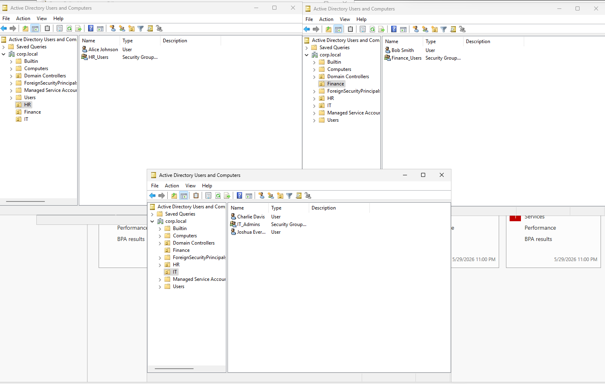
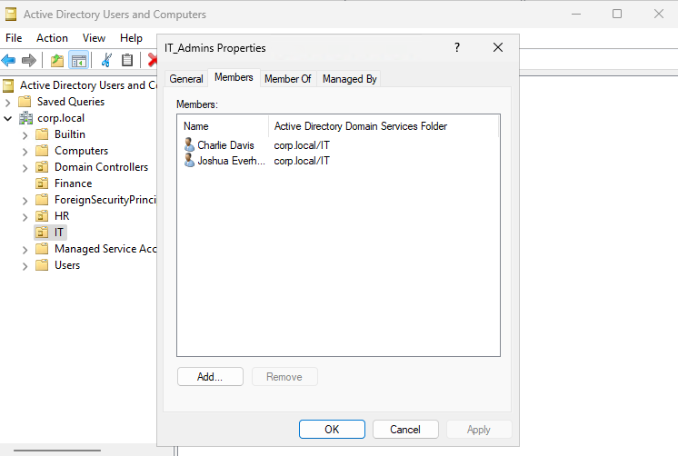
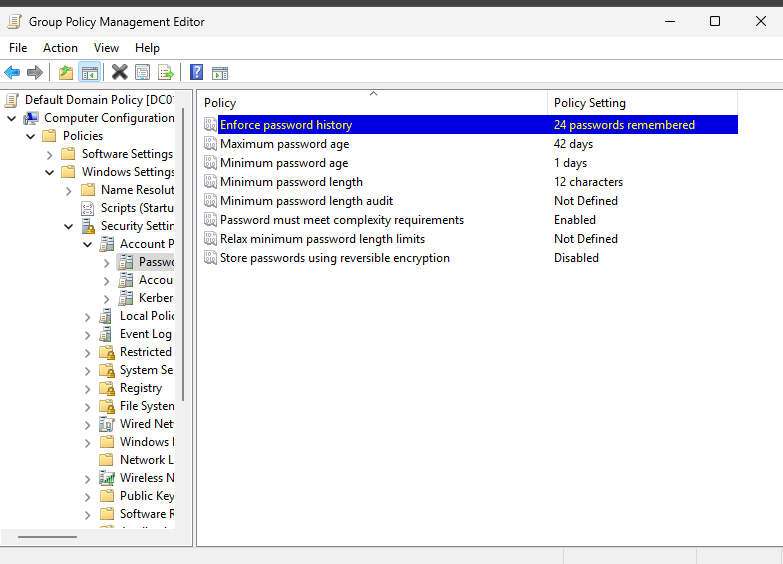

# Active Directory Enterprise Lab

## Overview

Built and administered an Active Directory environment using Windows Server 2025 and Windows 11, including domain services, DNS, Group Policy, role-based access controls, and domain authentication.

## Technologies Used

- Windows Server 2025
- Windows 11
- Active Directory Domain Services (AD DS)
- DNS
- Group Policy
- NTFS Permissions

## Environment

Domain: corp.local

### Domain Controller
- DC01

### Client Workstation
- WIN11-01

## Features Implemented

- Domain Controller deployment
- DNS configuration
- Organizational Units (OUs)
- User account management
- Security groups
- Role-Based Access Control (RBAC)
- Password policy enforcement
- Domain-joined workstation

## Organizational Structure

- HR
- Finance
- IT

## Users

- Alice Johnson (HR)
- Bob Smith (Finance)
- Joshua Everhart (IT)
- Charlie Davis (IT)

## Screenshots

See the screenshots uploaded in this repository.

## Skills Demonstrated

- Active Directory Administration
- Windows Server Administration
- Identity and Access Management (IAM)
- DNS Configuration
- Group Policy Management
- Access Control
- Security Administration

## Screenshots

### Active Directory Structure

### IT Admin Group Membership

### Password Policy

### Domain Joined Workstation

### Domain Authentication

